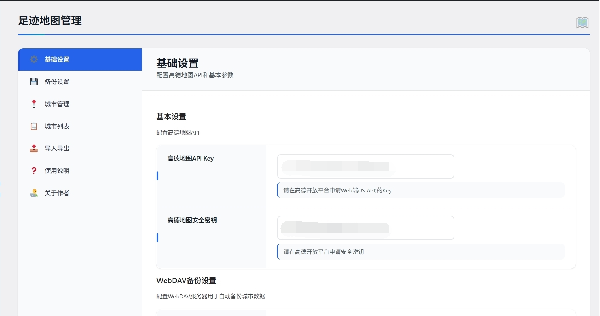
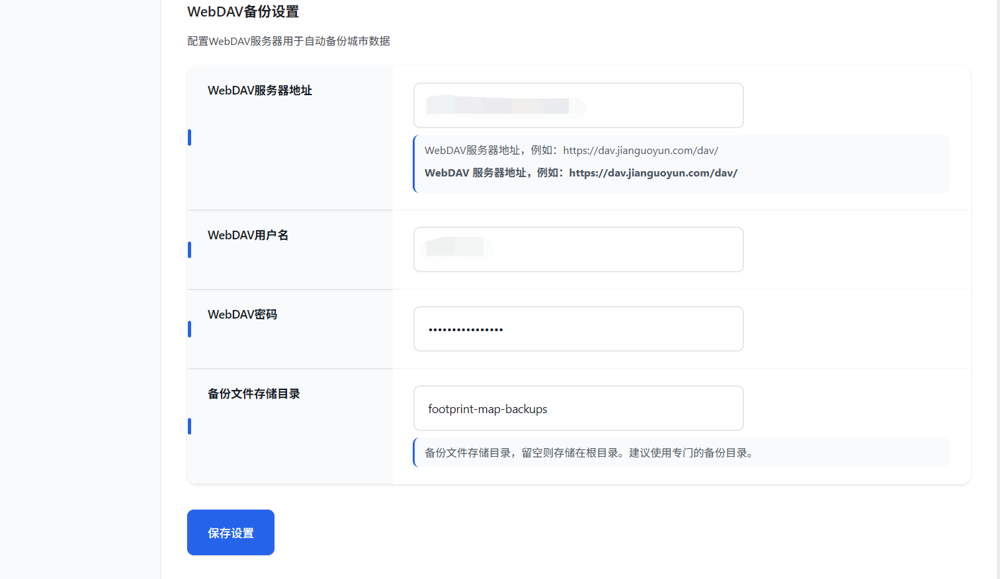
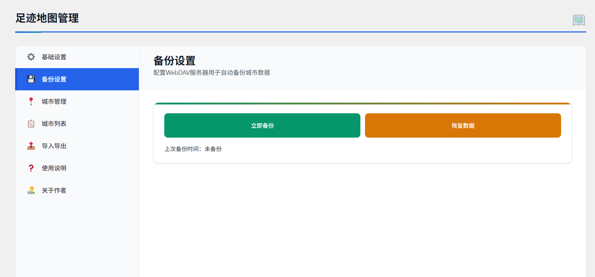
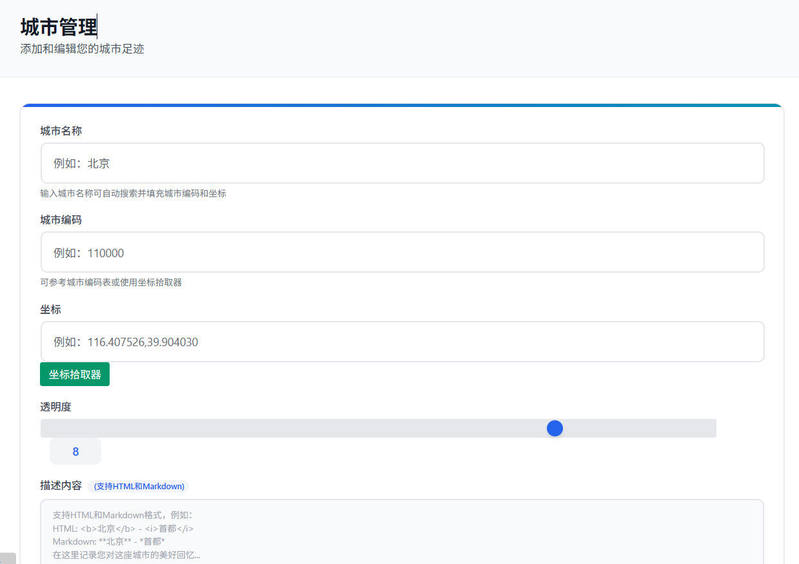
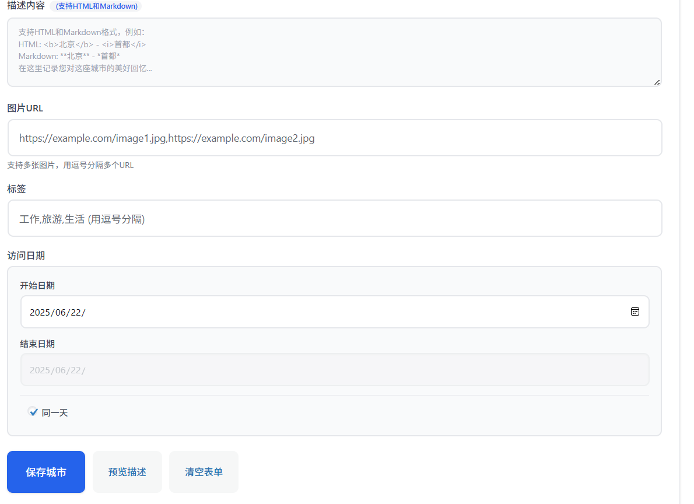
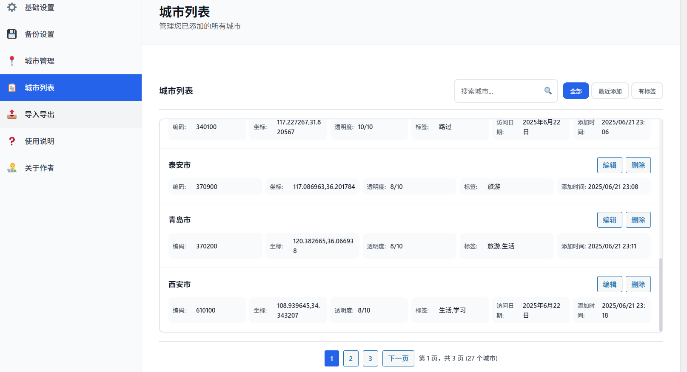
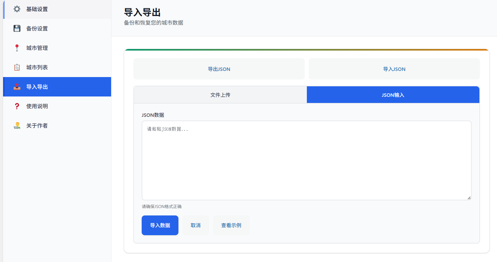
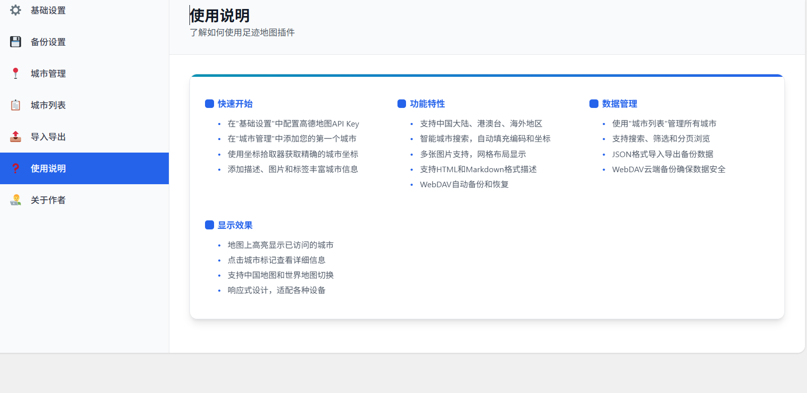

# 足迹地图 WordPress 插件

一个功能强大的 WordPress 插件，旨在帮助用户在地图上优雅地记录和展示其旅行足迹。本项目主要由 AI 编程助手 [Cursor](https://www.cursor.com/) 驱动开发。插件支持中国地图和世界地图两种视图，提供丰富的城市管理功能和美观的界面展示。

## 功能特性

### 🗺️ 地图展示
- **双视图支持**：中国地图（行政区划）和世界地图（全球视图）
- **智能标签避让**：自动计算标签位置，避免重叠
- **响应式设计**：适配各种屏幕尺寸
- **高德地图集成**：基于高德地图 API，提供流畅的交互体验

### 🏙️ 城市管理
- **智能搜索**：输入城市名称自动搜索匹配，支持中英文
- **批量操作**：支持 JSON 格式导入导出城市数据
- **时间段记录**：支持单日访问和访问时间段记录
- **标签系统**：为城市添加自定义标签，便于分类管理
- **图片展示**：支持多张图片，自动排列为网格布局

### 📸 图片功能
- **多图支持**：单张图片或多张图片（逗号分隔 URL）
- **智能布局**：根据图片数量自动调整网格排列
- **全屏查看**：点击图片可全屏查看，支持键盘导航
- **响应式显示**：图片自动适应卡片大小

### 💾 数据管理
- **WebDAV 备份**：支持 WebDAV 服务器自动备份和恢复
- **JSON 导入导出**：完整的数据备份和迁移功能
- **实时同步**：数据变更实时保存和同步

### 🎨 界面设计
- **现代化 UI**：简洁美观的界面设计
- **Toast 消息**：优雅的消息提示系统
- **分页显示**：大量城市数据的分页管理
- **搜索筛选**：快速查找和筛选城市

## Demo


## Admin Screenshots / 后台截图

<div align="center" style="overflow-x: auto; white-space: nowrap;">
  
  
  
  
  
  
  
  
</div>

## 安装要求

- **WordPress**: 5.0 或更高版本
- **PHP**: 7.4 或更高版本
- **浏览器**: 支持现代 JavaScript 的浏览器（Chrome、Firefox、Safari、Edge 等）
- **网络**: 需要访问高德地图 API 和 WebDAV 服务器（可选）
- **高德地图 API Key**: 免费申请，用于地图服务

## 安装步骤

### 方法一：WordPress 后台安装（推荐）
1. 在 WordPress 后台进入 "插件" → "安装插件"
2. 点击 "上传插件" 按钮
3. 选择下载的插件 zip 压缩包文件
4. 点击 "立即安装"
5. 安装完成后点击 "启用插件"

### 方法二：手动安装
1. 下载插件文件到 `wp-content/plugins` 目录
2. 在 WordPress 后台启用插件

## 配置说明

### 高德地图配置
1. 访问 [高德开放平台](https://lbs.amap.com/)
2. 注册账号并创建应用
3. 获取 API Key 和安全密钥
4. 在插件设置中填入相应信息

### WebDAV 备份配置（可选）
- **服务器地址**：WebDAV 服务器 URL
- **用户名密码**：WebDAV 账号信息
- **备份目录**：指定备份文件存储目录

## 使用方法

### 添加城市
1. 在管理界面点击 "添加城市"
2. 输入城市名称，系统会自动搜索匹配
3. 选择城市后自动填充编码和坐标
4. 设置访问日期、标签、描述等信息
5. 可选：添加图片 URL（支持多张，逗号分隔）
6. 点击保存

### 地图展示
使用短代码 `[footprint_map]` 在页面中显示地图。

### 数据备份
- **自动备份**：配置 WebDAV 后自动备份
- **手动导出**：导出 JSON 格式数据文件
- **数据恢复**：从备份文件或 JSON 文件恢复

## 数据格式

### 城市数据结构
```json
{
  "name": "城市名称",
  "adcode": "城市编码",
  "center": "经度,纬度",
  "opacity": 8,
  "tags": "标签1,标签2",
  "image": "图片URL1,图片URL2",
  "date_start": "2023-01-01",
  "date_end": "2023-01-05",
  "is_date_range": true,
  "desc": "描述内容"
}
```

### 图片 URL 格式
- 单张图片：`https://example.com/image.jpg`
- 多张图片：`https://example.com/image1.jpg,https://example.com/image2.jpg`

## 自定义样式

插件提供丰富的 CSS 类名，支持自定义样式：

```css
/* 信息窗口样式 */
.city-info { }
.city-name { }
.city-tags { }
.city-description { }
.city-images { }

/* 图片网格样式 */
.city-image { }
.image-modal { }

/* 标签样式 */
.tag { }
```

## 常见问题

**Q: 地图无法显示？**
A: 请检查高德地图 API Key 配置是否正确，确保网络连接正常。

**Q: 城市搜索无结果？**
A: 插件内置了中国大陆、港澳台、海外地区数据，确保输入的城市名称正确。

**Q: 图片无法显示？**
A: 检查图片 URL 是否可访问，建议使用 HTTPS 链接。

**Q: WebDAV 备份失败？**
A: 检查 WebDAV 服务器配置，确保目录有写入权限。

## Changelog / 更新日志

### [1.2.1] - 2025-06-22
**新增**
- 系统版本要求检查功能：WordPress 5.0+、PHP 7.4+、JSON/mbstring/cURL 扩展
- 插件激活时自动检查系统要求，不满足要求时阻止激活
- 管理页面显示版本要求警告和详细错误提示

**优化**
- README 文档更新，明确系统和浏览器要求
- 完善网络访问说明，优化安装步骤

**技术改进**
- 使用 `version_compare()` 和 `function_exists()` 检查环境
- 集成 WordPress 标准错误处理，用户界面反馈更友好

---

### [1.2.0] - 2024-06-22
**重大界面升级**
- 全新侧边菜单导航，7 大功能板块独立页面
- URL 哈希导航，支持直接访问特定功能页

**新增功能**
- 基础设置、备份设置、城市管理、城市列表、导入导出、使用说明、关于作者等板块
- 实时搜索、智能筛选、数据导入导出、详细使用指南

**界面优化**
- 卡片式布局、统一配色、响应式设计、现代化动画
- 桌面 / 平板 / 移动端自适应

**技术改进**
- 模块化架构、性能优化、智能缓存、减少 DOM 操作

---

### [1.1.5] - 2025-06-22
**优化**
- 设置页面现代化升级，卡片化设计，彩色装饰条，动画优化
- 响应式布局，移动端体验提升
- 消息提示、表单、分页控件等全面美化

**技术改进**
- CSS 变量系统，提升主题定制性
- 增强无障碍性，键盘导航体验提升

---

### [1.1.4] - 2025-06-22
**优化**
- 后台布局紧凑化，提升空间利用率
- 侧边栏、城市列表、表单、分页控件等尺寸优化
- 响应式设计，移动端紧凑布局

**技术改进**
- 统一间距系统，优化网格比例，减少视觉噪音

---

### [1.1.3] - 2025-06-22
**优化**
- 后台 UI 全面现代化升级，卡片设计、动画、按钮、分页等美化
- 文件上传、描述预览、帮助内容等界面优化
- Toast 消息提示现代化，移动端体验提升

**技术改进**
- CSS 变量、统一动画、优化阴影、增强无障碍性

---

### [1.1.2] - 2025-06-22
**新增**
- 图片自适应排列，支持 1-12 张图片智能网格
- 图片点击全屏查看，支持键盘导航

**优化**
- 图片网格布局、悬停动画、信息窗口边界检测、响应式显示

**修复**
- 信息窗口固定大小，箭头定位修正
- 图片点击事件、模态框、垂直居中、索引等问题修复

## 技术支持与反馈
**请注意：** 这个项目是我在 AI 编程助手 Cursor 的帮助下开发和维护，作为一名科技爱好者，独立解决复杂技术问题的能力有限。因此，如果您遇到问题，我非常鼓励您也尝试利用AI工具来寻找解决方案，这本身也是一种有趣的探索！尽管如此，我依然会关注您提出的Issue，并尽力而为。

如果您在使用中遇到任何问题，或有任何改进建议，请通过以下方式联系：

- **GitHub Issues**: 在 [项目仓库](https://github.com/Frank-Loong/Footprint-Map) 提交 Issue 是最推荐的方式。
- **Email**: frankloong@qq.com
- **个人网站**: [https://frankloong.com](https://frankloong.com)

## 参考文献
- [空屿 - 如何用Leaflet创建旅行足迹地图](https://pinaland.cn/archives/travel-map-leaflet.html)
- [Chrison - 如何用高德地图在博客中点亮城市制作旅行足迹](https://chrison.cn/work/313.html)
- [荒野孤灯 - 记录（我的足迹 — 升级版）功能实现过程](https://www.80srz.com/posts/footprintmap.html)
- [obaby - 我的足迹【终极完整版】](https://h4ck.org.cn/2024/11/18564)

## 许可证

本插件采用 GPL v3 许可证。

## 致谢

- 本项目的开发得到了 AI 编程助手 [Cursor](https://cursor.sh) 的巨大帮助，它显著提升了开发效率和代码质量。
- 感谢 [高德开放平台](https://lbs.amap.com/) 提供强大的地图服务。
- 感谢 [WordPress](https://wordpress.org/) 社区提供了一个卓越的平台。
- 感谢所有为本项目提供反馈和建议的用户。

## 项目结构

```
footprint-map/
├── footprint-map.php              # 主插件文件
├── uninstall.php                  # 卸载清理文件
├── README.md                      # 说明文档
├── CHANGELOG.md                   # 更新日志
├── assets/
│   ├── js/
│   │   ├── footprint-map.js       # 前端地图功能
│   │   └── footprint-map-admin.js # 管理界面功能
│   ├── css/
│   │   ├── footprint-map.css      # 前端样式
│   │   └── footprint-map-admin.css # 管理界面样式
│   └── data/
│       ├── China-Mainland.json    # 中国大陆城市数据
│       ├── China-HongKong.json    # 香港地区数据
│       ├── China-Macau.json       # 澳门地区数据
│       ├── China-Taiwan.json      # 台湾地区数据
│       └── Global-Overseas.json   # 海外国家数据
└── languages/
    └── footprint-map-zh_CN.po     # 中文语言文件
```

---

*让每一次旅行都留下美好的足迹回忆* 

## Star History

[](https://star-history.com/Frank-Loong/Footprint-Map&Date)
